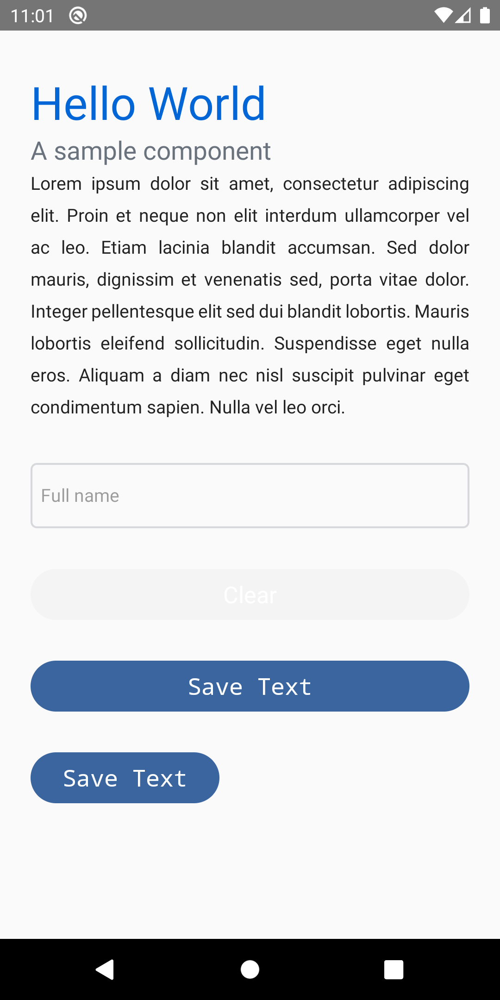
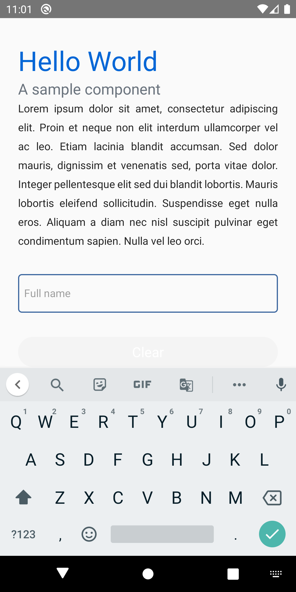
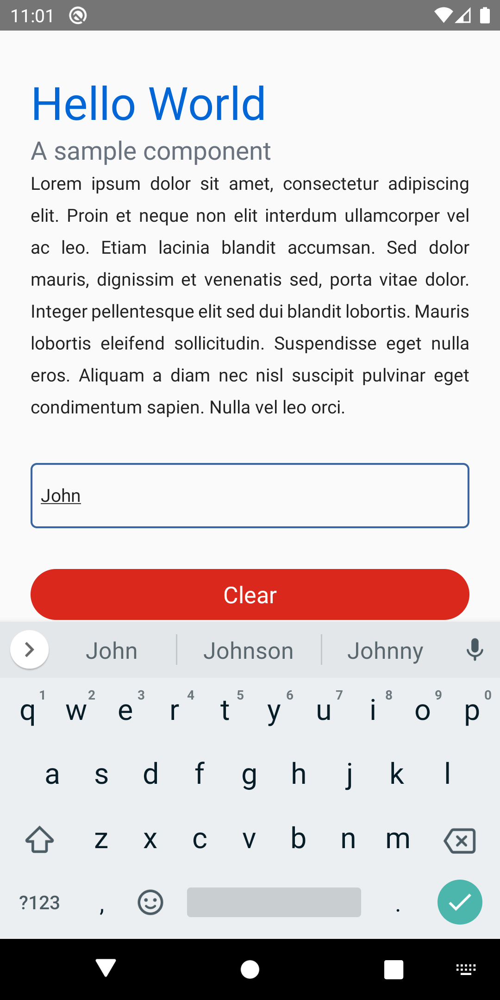

# POC: React Native Components

It demonstrates how to write React/Native components by splitting behavior and presentation.

## How to run

| Description | Command |
| :--- | :--- |
| Install dependencies | `npm install` |
| Start Metro | `npm run start` |
| Run app | `npm run android` |

## Preview

| | |
| :--: | :--- |
|  |  |
|  |  |
